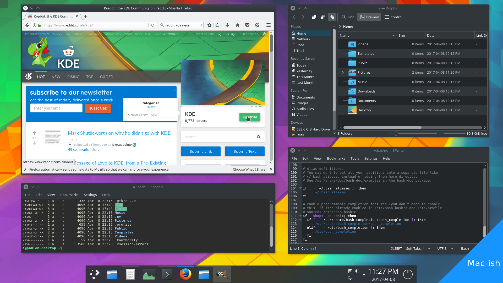
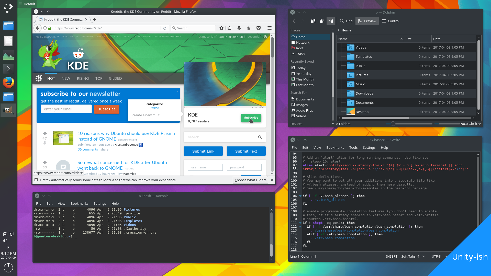
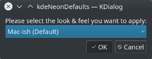

[](https://github.com/paulondc/kdeNeonDefaults/issues)

## What is this project about ?

This project is used to share initial [KDE neon](https://neon.kde.org/) settings that simplify even further some of the defaults in KDE neon. The overall goal is to provide a clean & powerful workflow without giving up usability enhancements that take advantage of modern hardware.

It's available in two flavours:


---


## How does it work ?
Everything is done on top of [KDE neon](https://neon.kde.org/), it does not require any external dependency.


It works by providing pre-defined config files that were isolated from a fresh [KDE neon](https://neon.kde.org/) installation. It contains modifications all over KDE from little things aka not showing the [bouncing icon during the launch of applications](https://www.youtube.com/watch?v=31g0YE61PLQ) () to changing some of the global shortcuts (described further below).

## How do I get it ?
You can get it by simply running the line bellow in your terminal :point_down:
```bash
cd $(mktemp -d) && wget https://github.com/paulondc/kdeNeonDefaults/archive/master.zip -O kdeNeonDefaults.zip && unzip kdeNeonDefaults.zip && cd kdeNeonDefaults-master && ./setup
```
> Be aware by running the setup it will override your current settings (you may want to create a backup of your current configuration for the directories  `~/.config, ~/.kde and ~/.local` beforehand).

***Dialogue displayed during the setup***



---

### Customized shortcuts:
- open dolphin:  `super + e`
- open konsole: `super + r`
- minimize/restore all windows: `super + d`
- close current window: `ctrl + w` or `alt + F4`
- change to next virtual desktop: `alt + left`
- change to previous virtual desktop: `alt + right`

For the next set of shortcuts I recommend you to put a [sticker on F8 key](./data/f8-sticker.png):


- present all windows (expose): `F8`
- show desktop grid (spaces): `ctrl + F8`
- show desktop: `shift + F8`

### Fine integrated/customized applications:
- kwrite
- dolphin
- konsole
- kdiff3
- konversation

## Licensing
kdeNeonDefaults is free software; you can redistribute it and/or modify it under the terms of the MIT License.
